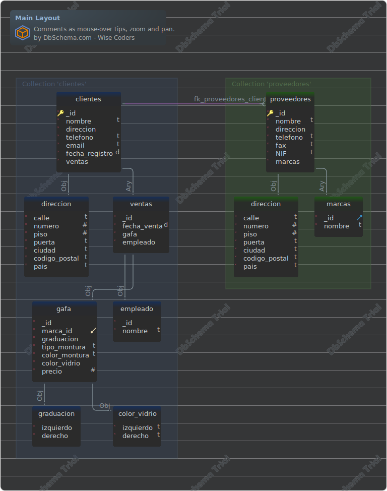

# mongoDB-estructura
Repositorio para aprender a modelar bases de datos NoSQL utilizando MongoDB. Este repositorio contiene la configuración necesaria para iniciar una instancia de MongoDB y Mongo-Express usando Docker.

## Estructura del repositorio

```csharp
.
├── docker-compose.yaml
├── mongo-init.js
└── README.md
```
Descripción de archivos

- `docker-compose.yaml`: Archivo de configuración para iniciar una instancia de MongoDB y Mongo-Express usando Docker.
- `mongo-init.js`: Script de inicialización de la base de datos con colecciones y datos de la optica.
- `README.md`: Documentación del repositorio y la estructura de la base de datos.


## Diagrama y Tablas
El diagrama y las tablas fueron generados usando [DbSchema](https://dbschema.com). El diagrama muestra la estructura de las colecciones y las relaciones entre ellas.

### Diagrama de la optica



## Tablas

1. [optica.clientes](#collection-opticaclientes) 
2. [optica.proveedores](#collection-opticaproveedores) 

### Collection optica.clientes 
| | | |
|---|---|---|
| * &#128273;  | \_id| objectId  |
| * | nombre| string  |
| * | direccion| object  |
| * | direccion.calle| string  |
| * | direccion.numero| int  |
| * | direccion.piso| int  |
| * | direccion.puerta| string  |
| * | direccion.ciudad| string  |
| * | direccion.codigo\_postal| string  |
| * | direccion.pais| string  |
| * | telefono| string  |
| * | email| string  |
| * | fecha\_registro| date  |
| * | ventas| array[object]  |
| * | ventas.\_id| objectId  |
| * | ventas.fecha\_venta| date  |
| * | ventas.gafa| object  |
| * | ventas.gafa.\_id| objectId  |
| * &#11019; | ventas.gafa.marca\_id| objectId  |
| * | ventas.gafa.graduacion| object  |
| * | ventas.gafa.graduacion.izquierdo| object  |
| * | ventas.gafa.graduacion.derecho| object  |
| * | ventas.gafa.tipo\_montura| string  |
| * | ventas.gafa.color\_montura| string  |
| * | ventas.gafa.color\_vidrio| object  |
| * | ventas.gafa.color\_vidrio.izquierdo| string  |
| * | ventas.gafa.color\_vidrio.derecho| string  |
| * | ventas.gafa.precio| int  |
| * | ventas.empleado| object  |
| * | ventas.empleado.\_id| objectId  |
| * | ventas.empleado.nombre| string  |


#### Indices
| | | |
|---|---|---|
| &#128273;  | \_id\_ | ON \_id|


### Collection optica.proveedores 
| | | |
|---|---|---|
| * &#128273;  | \_id| objectId  |
| * | nombre| string  |
| * | direccion| object  |
| * | direccion.calle| string  |
| * | direccion.numero| int  |
| * | direccion.piso| int  |
| * | direccion.puerta| string  |
| * | direccion.ciudad| string  |
| * | direccion.codigo\_postal| string  |
| * | direccion.pais| string  |
| * | telefono| string  |
| * | fax| string  |
| * | NIF| string  |
| * | marcas| array[object]  |
| * &#11016; | marcas.\_id| objectId  |
| * | marcas.nombre| string  |


#### Indices 
| | | |
|---|---|---|
| &#128273;  | \_id\_ | ON \_id|

#### Relaciones
| | | |
|---|---|---|
| Vir | fk_proveedores_clientes | ( marcas.\_id ) ref [optica.clientes](#clientes) (ventas.gafa.marca\_id) |


## Cómo ejecutar el proyecto

1. Asegúrate de tener instalado Docker y Docker Compose en tu sistema.
2. Abre una terminal y navega hasta la carpeta del proyecto.
3. Ejecuta el siguiente comando para iniciar los contenedores de Docker:
```bash
docker-compose up
```
4. Abre un navegador y visita `http://localhost:8081` para acceder a Mongo-Express y gestionar la base de datos MongoDB.

## Colecciones en la base de datos

- `proveedores`: Contiene información sobre los proveedores, como nombre, dirección, teléfono, fax, NIF y marcas.
- `clientes`: Contiene información sobre los clientes, como nombre, dirección, teléfono, correo electrónico, fecha de registro y ventas realizadas.

## Detener el proyecto

Para detener los contenedores de Docker y eliminar los recursos, ejecuta el siguiente comando en la terminal:
```bash
docker compose down
```
